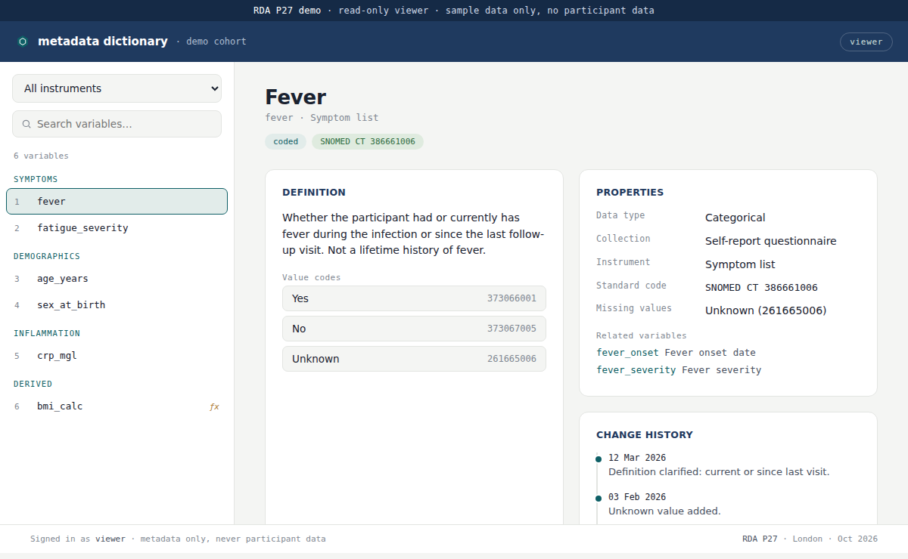

<h2 align="center">Metadata dictionary — RDA P27 demo</h2>

<em>A read-only demo of a web-based tool for governing a research data dictionary.</em>

  
  

### About

This is a small, read-only demo that accompanies the poster
*Beyond spreadsheets: governing the metadata dictionary for FAIR research data*
(RDA 27th Plenary, London, October 2026).

A data dictionary is the reference that describes every variable in a study: what it means,
how it was measured, what its codes are. In most projects it lives in a shared spreadsheet
that several people edit at once, which is where errors and drift creep in. This tool takes
the dictionary itself as the thing worth governing: a web-based, metadata-only view where a
team can browse, search, and read their variables, with every change recorded. It holds
descriptions of variables only, never participant data.

### Try it

The demo runs entirely in the browser, with a handful of sample variables.

- **Live demo:** _add your GitHub Pages link here_
- Browse variables by instrument, search by name, and open any variable to see its
  definition, properties, value codes, and change history.

  

### What it shows

Each variable in the demo carries the kind of information a dictionary needs to be useful to
someone outside the team that collected it:

- a plain-language definition
- data type, unit, and how the variable was collected
- the standard code it maps to (SNOMED CT, LOINC)
- value codes for categorical variables
- derivation formulas for derived variables
- a change history

The variables shown are illustrative and contain no participant data.

### Status

This is a demo of a tool that is still in development. A fuller description of the work,
including the reference model behind it, will follow with the associated papers.

### Contact

Hajar Hasannejadasl · [hajar.hasannejad@gmail.com](mailto:hajar.hasannejad@gmail.com)
· [Website](https://hajarhn.github.io/Main/)
· [ORCID](https://orcid.org/0000-0001-5262-7399)
